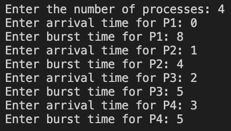
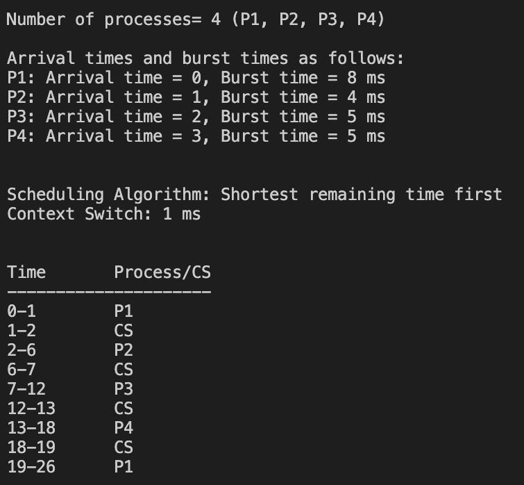
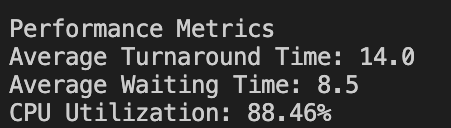
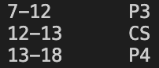
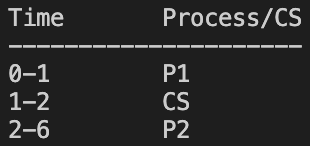

# **Process Scheduling Simulator**  

## **Introduction**  
Welcome! We present **Process Scheduling Simulator**, a Java-based program that simulates the **Shortest Remaining Time First (SRTF)** scheduling algorithm. This project showcases efficient process scheduling, preemption handling, and real-time performance analysis in a multiprogramming environment.  

---

## **About the Project**  

### **What It Does**  
- **Simulates Process Scheduling**: Implements **SRTF (Preemptive SJF)** with **FCFS for tie-breaking**.  
- **Event-Driven Execution**: Uses an **event queue** to manage process arrivals, execution, and termination.
- **Handles Context Switching**: Accounts for **1 ms** context switch delays.  
- **Calculates Performance Metrics**: Outputs **CPU utilization, average turnaround time, and average waiting time**.  
- **Gantt Chart Visualization**: Displays process execution timeline for better understanding.  

---

## **Features**  

### **Efficient Scheduling**  
- Prioritizes processes with the shortest remaining time.  
- Preempts running processes when a shorter job arrives.  

### **Dynamic Process Execution**  
- Maintains an **event queue** to simulate real-time scheduling.  

### **Performance Metrics Calculation**  
- **CPU Utilization**  
- **Average Turnaround Time**  
- **Average Waiting Time**  

### **Gantt Chart Visualization**  
- Provides a **clear execution timeline** for process scheduling.  

---

## **Technologies Used**  

- **Language**: Java  
- **Data Structures**: Priority Queue, Linked List  
- **Algorithm**: Shortest Remaining Time First (Preemptive SJF)  
- **Visualization**: Console-based Gantt chart representation  

---

## **Example Output**  

### **Input**  

### **Execution Timeline (Gantt Chart)**  

### **Performance Metrics**  

---

## **Screenshots & Demonstrations**  
### **FCFS Demonstration**  

*Processes with equal CPU burst times handled in FCFS order.*  

Time: 7–12 (P3) → 12–13 (CS) → 13–18 (P4)
- P3 and P4 both have burst times of 5 ms, but P3 arrives first (time 2), followed by P4 (time 3).
- Consequently, P3 gets the CPU first at time 7 and runs until time 12, and only after that does P4 get scheduled.
- This demonstrates FCFS behavior when two processes have the same burst time, but the one that arrived first is executed first.

### **Preemption Demonstration**  

*A newly arriving process with a shorter CPU burst preempts the current process.*  

Time: 0–1 (P1) → 1–2 (CS) → 2–6 (P2)
- At time 1, P2 arrives with a burst time of 4 ms, which is shorter than P1's remaining 7 ms.
- This causes a context switch (1–2), and then P2 starts execution (2–6).
- This demonstrates preemption because P1 was interrupted to give the CPU to a process with a shorter remaining time.

---

## **Team Members**  

- **Leen Alotaibi** (Leader) – `443200417`
- **Jood Alkhrashi** – `444203007`
- **Lujain** – `444200785`  
- **Najla Almazyad** – `444200948`  

### **Task Distribution Table**  
| Task | Assigned Member |
|------|----------------|
| Process & User Interface & ReadMe | Leen |
| Scheduling Algorithm | Najla |
| Event-Driven Simulation | Lujain |
| Performance Metrics & Visualization | Jood |

---

## **Conclusion**  
Thank you for checking out **Process Scheduling Simulator**!
